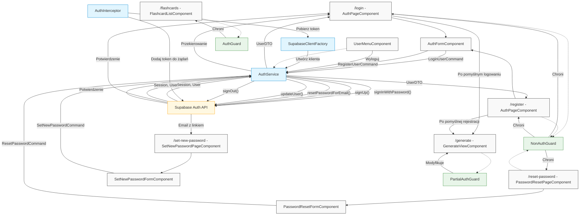
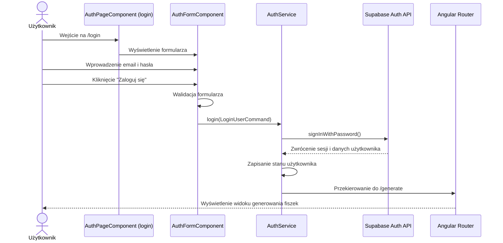
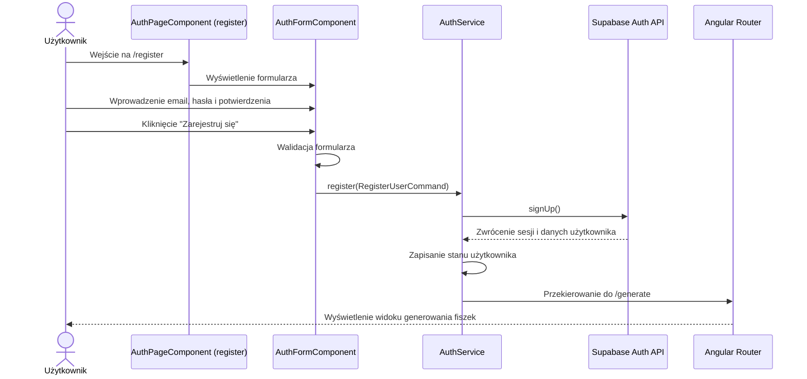
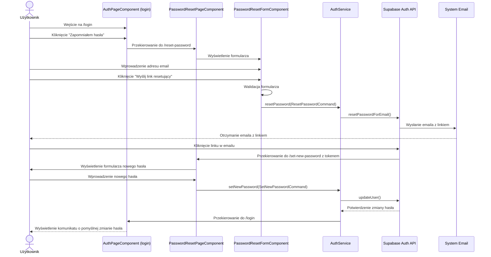
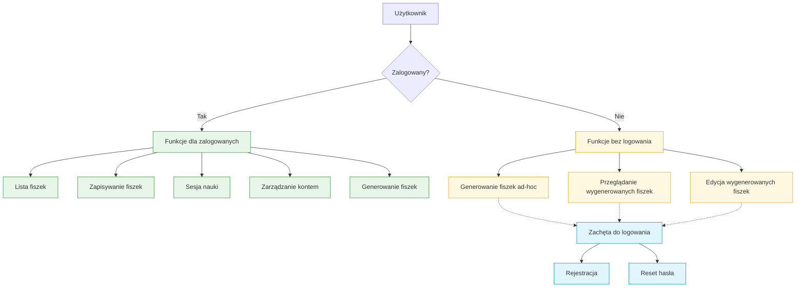

# Diagram przepływu autentykacji w aplikacji 10xCards

Poniższy diagram przedstawia architekturę i przepływ procesu autentykacji w aplikacji 10xCards, zgodnie ze specyfikacją techniczną.

## Diagram komponentów i przepływu danych

## Diagram sekwencji procesu logowania

## Diagram sekwencji procesu rejestracji

## Diagram sekwencji procesu odzyskiwania hasła

## Diagram dostępu do funkcjonalności

