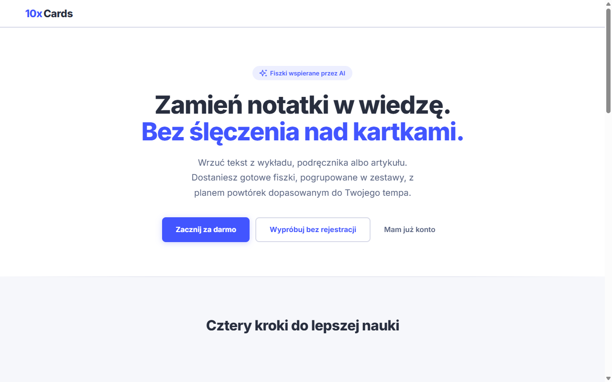
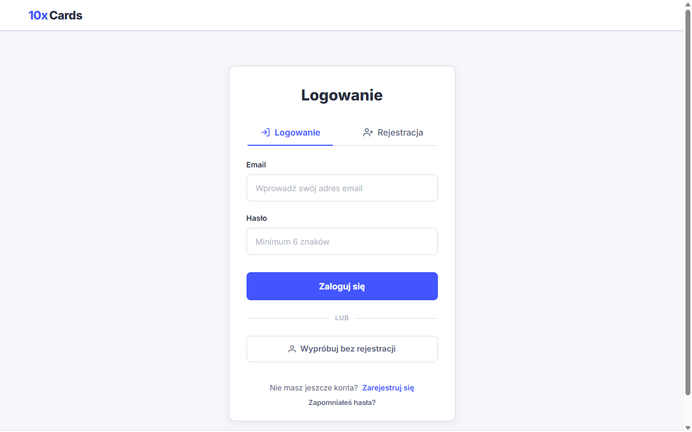
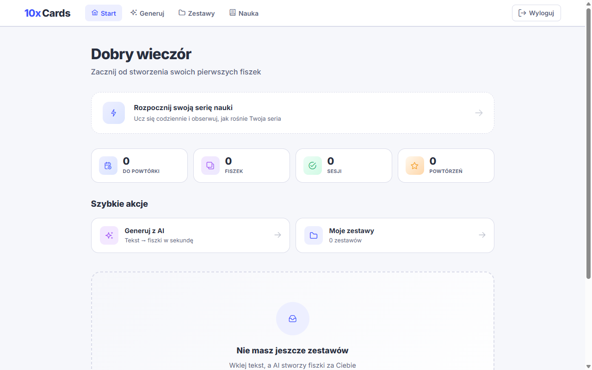
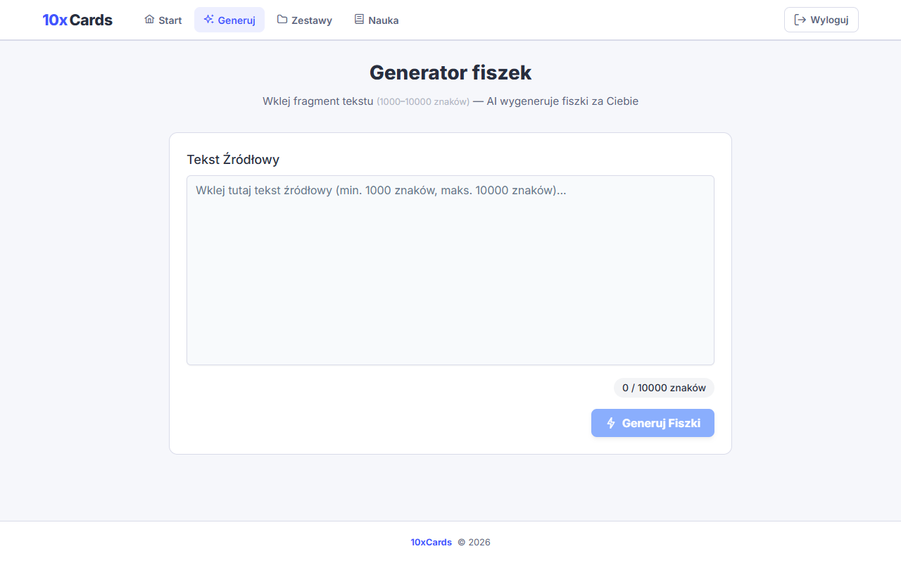
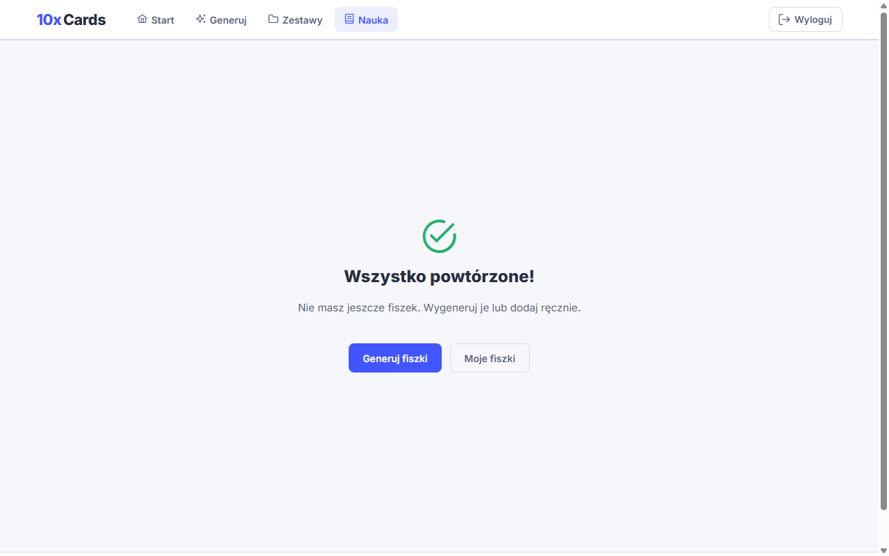

# 10xCards

Aplikacja do tworzenia i zarządzania fiszkami edukacyjnymi wspierana przez AI. Wklej tekst z wykładu, podręcznika lub artykułu — sztuczna inteligencja wygeneruje gotowe fiszki, a algorytm SM-2 zaplanuje powtórki dopasowane do Twojego tempa nauki.

## Screenshoty

### Landing page


### Logowanie


### Dashboard


### Generator fiszek (AI)


### Sesja nauki


## Funkcje

- **Generowanie fiszek z AI** — wklej tekst (1000–10000 znaków), a model LLM (stepfun/step-3.5-flash) wygeneruje do 15 fiszek
- **Tryb bez rejestracji** — kliknij „Wypróbuj bez rejestracji" na stronie logowania lub landing page, aby korzystać z aplikacji anonimowo, bez podawania emaila i hasła
- **Zestawy tematyczne** — grupuj fiszki w zestawy (np. osobny na każdy przedmiot)
- **Inteligentne powtórki** — algorytm SM-2 z oceną 1 (nie wiem) / 3 (trudne) / 4 (wiem) planuje, kiedy powtórzyć pytanie
- **Edycja propozycji** — akceptuj, odrzucaj i edytuj fiszki zaproponowane przez AI
- **Dashboard** — statystyki: seria nauki, fiszki do powtórki, liczba sesji

## Stack technologiczny

| Warstwa | Technologia |
|---------|-------------|
| Frontend | Angular 19 (standalone, OnPush, signals) |
| State management | NgRx (auth store) |
| UI | PrimeNG 19, Tailwind CSS 4 |
| Backend / Auth | Supabase (PostgreSQL, Auth, RLS) |
| AI | OpenRouter API (stepfun/step-3.5-flash:free) |
| Hosting | Cloudflare Pages |

## Uruchomienie

### Wymagania
- Node.js 18+
- Konto Supabase (projekt + klucze)
- Klucz API OpenRouter

### Instalacja

```bash
cd angular-without-ssr
npm install
```

### Zmienne środowiskowe

Utwórz plik `src/environments/environments.ts`:

```typescript
export const environment = {
  production: false,
  supabaseUrl: 'https://YOUR_PROJECT.supabase.co',
  supabaseKey: 'YOUR_ANON_KEY',
  openRouterKey: 'YOUR_OPENROUTER_KEY'
};
```

### Development server

```bash
npm start
```

Aplikacja będzie dostępna pod `http://localhost:4200/`.

### Build produkcyjny

```bash
npm run build:prod
```

## Struktura projektu

```
angular-without-ssr/src/app/
├── auth/               # Autentykacja (NgRx store, guards, serwis)
├── components/
│   ├── dashboard/      # Panel główny ze statystykami
│   ├── generate/       # Generator fiszek AI
│   ├── flashcards/     # Lista fiszek w zestawie
│   ├── sets/           # Zarządzanie zestawami
│   ├── study/          # Sesja nauki (SM-2)
│   ├── landing/        # Strona główna
│   └── onboarding/     # Onboarding po rejestracji
├── services/           # Serwisy API (flashcard, generation, review, openrouter)
├── shared/             # Współdzielone komponenty i serwisy
└── interfaces/         # Interfejsy TypeScript
```
